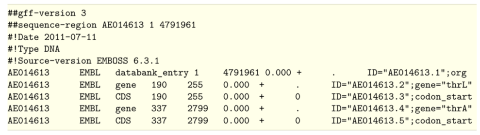
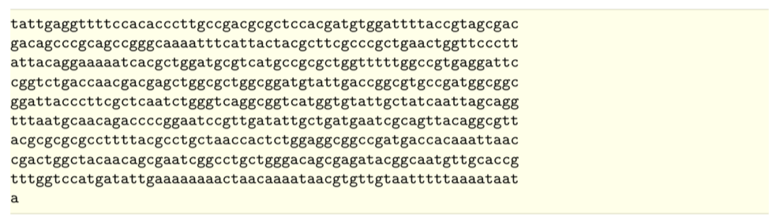

# Module - Linux Scripting

## Overview and Aims

### Introducing Linux
Unix is the standard operating system on most large computer systems in scientific
research, in the same way that Microsoft Windows is the dominant operating system
on desktop PCs.

Unix and MS Windows both perform the important job of managing the computer's
hardware (screen, keyboard, mouse, hard disks, network connections, etc...) on
your behalf. They also provide you with tools to manage your files and to run
application software. They both offer a graphical user interface (desktop). These
desktop interfaces look different between the operating systems, use different
names for things (e.g. directory versus folder) and have different images but
they mostly offer the same functionality.

Unix is a powerful, secure, robust and stable operating system which allows dozens
of people to run programs on the same computer at the same time. This is why it
is the preferred operating system for large-scale scientific computing. It runs
on all kinds of machines, from mobile phones (Android), desktop PCs... to supercomputers.

### Why Linux

Increasingly, the output of biological research exists as in silico data, usually
in the form of large text files. Unix is particularly suitable for working with
such files and has several powerful and flexible commands that can be used to
process and analyse this data. One advantage of learning Unix is that many of the
commands can be combined in an almost unlimited fashion. So if you can learn just
six Unix commands, you will be able to do a lot more than just six things.

Unix contains hundreds of commands, but to conduct your analysis you will probably
only need 10 or so to achieve most of what you want to do. In this course we will
introduce you to some basic Unix commands followed by some more advanced commands
and provide examples of how they can be used in bioinformatics analyses.

### Sections of the Unix course
1. Basic unix
2. Files
3. loops and bash scripts
4. grep
5. awk


### General points to consider
- Linux is pretty straightforward, but there are some general points to remember that will make your life easier:
     - Linux is case sensitive - typing "ls" is not the same as typing "LS".
     - You need to put a space between a command and its argument - for example, "more myfile" will show you the contents of the file called myfile; "moremyfile" will just give you an error!
     - Linux is not psychic! If you misspell the name of a command or the name of a file, it will not understand you.
     - Many of the commands are only a few letters long; this can be confusing until you start to think logically about why those letters were chosen - ls for list, rm for remove and so on.
     - Often when you have problems with Linux, it is due to a spelling mistake, or perhaps you have omitted a space.
- If you want to know more about Linux and its commands there are plenty of resources available that provide a more comprehensive guide, for example:
     - http://Linuxhelp.com
     - https://learn.datacamp.com/

### Following the course in a terminal
- In this course you will use a terminal window to type in your Unix commands.
- This is similar to the "Command Prompt" window on MS Windows systems, which allows the user to type DOS commands to manage files.


### Cheat sheet
- We've also included a cheat sheet. It probably won't make a lot of sense now, but it might be a useful reminder of this module later in the course.

### Some useful Linux commands
| Command   |    What it does   |
| ---  |    ---  |
| ls   | Lists the contents of the current directory  |
| mkdir | Makes a new directory    |
| mv   | moves or renames a file  |
| cp   | copies a file  |
| rm   | removes a file |
| cat | concatenates two or more files |
| less |    displays the contents of a file one page at a time     |
| head | displays the first ten lines of a file |
| tail |    displays the last ten lines of a file   |
| cd | change directory   |
| pwd | print the working directory |
| find | find files matching an expression     |
| grep | search for a pattern within a file    |
| wc | count the lines, words, characters or bytes in a file |
| kill | stop a process |
| jobs | list the processes that are running |

### Tips to get you started
- read the text! They contain lots of hints that should help you to answer some of the questions
- grey boxes contain instructions for running commands
     - lines that start with a hash, ie "#" are a comment line - do not type these out.
     - lines that start with the following symbols should be typed out
          - "$" : this is a shell prompt
          - ">" :  this is a R prompt
               - note that you also see this on the shell prompt if you have not completed a command correctly
          - ">>>" : this is the python prompt


---
### Lets get started with the command line
- In this workshop, we will be using Ubuntu, a version of Linux which was specially designed for PCs.

- We will use a terminal window to type in our Linux command line.
     - This is similar to the "Command Prompt" window on MS Windows systems, which allows the user to type DOS commands to manage files.


- You should see a window labelled "Terminal" which will be empty except for a ’$' character at the top left.      
     - The '$' character is the Linux prompt, similar to "C:\" in DOS. Note: the prompt will often be different on different Linux computers, for example it may be displayed as a ‘%’ character.

- All Linux programs may be run by typing commands at the Linux prompt $. The command line tells the computer what to do.
     - You can type commands directly into the terminal at the ‘$' prompt.


```bash
# your first command – move to the working directory to get started!

cd /home/manager/Module2_Linux_Scripting
```

- A list of useful commands can be found on a previous page.
     - Many of them are two- or three-letter abbreviations. The earliest Linux systems (circa 1970) only had slow Teletype terminals, so it was faster to type 'rm' to remove a file than 'delete' or 'erase'. This terseness is a feature of Linux which still survives.

---
### Command line arguements
- You may subtly alter these commands by specifying certain options when typing in the command line.
- Typing any Linux command for example ls, mv or cd at the Linux prompt with the appropriate variables such as files names or directories will result in the tasks being performed on pressing the enter key.
- The ‘command’ is separated from the options and arguments by a space.  
- Additional options and/or arguments can be added to the commands to affect the way the command works.
- Options usually have one dash and a letter (e.g. -h) or two dashes and a word (--help) with no space between the dash and the letter/word.
- Arguments are usually filenames or directories.
- For example, to get a list of files in the terminal you can use the ls command with no other options. This tells the computer you want a list of all the files in the current directory.  The same information is also displayed in the file browser but with nice looking pictures.


- Lets try out some different examples of the "ls" command:
```bash
# List the contents of a directory
$ ls

# List the contents of a directory with extra information about the files
$ ls –l

# List all contents including hidden files & directories
$ ls –al 	

# List the contents of the directory called basic with extra information
$ ls –l basic

# Suggested usage – this will be the most frequent command used as a bioinformatician!
$ ls –ltr

# where:
	–l gives the long format,
	-t sort the output by time,
	–r reverse sorts the output.

# this will therefore provide a detailed list, with the most recent files at the bottom. This is really useful if you have a lot of files in the same directory
```

- By using the –l option we can change the behaviour of the ls command. Instead of printing out a simple list, it will print out additional information about each file. There is a space between the command ls and the –l option. There is no space between the dash and the letter l.


---
### Permissions
- Every file has permissions which restrict what can be done with a file or directory.  

| Permission   |    What it does   |
| --- | --- |
| Read (r) |	permission to read from a file/directory |
| Write (w) | 	permission to modify a file/directory |
| Execute (x) | 	Tells the operating system that the file contains code for the computer to run, as opposed to a file of text which you open in a text editor. |

- The first set of permissions (characters 2,3,4) refer to what the owner of the file can do,
- the second set of permissions (5,6,7) refers to what members of the Linux group can do
- the third set of permissions (8,9,10) refers to what everyone else can do.


---
### Files and Directories
- Directories are the Linux equivalent of folders on a PC or Mac.
- They are organised in a hierarchy, so directories can have sub-directories and so on.
- Directories are very useful for organising your work and keeping your account tidy - for example, if you have more than one project, you can organise the files for each project into different directories to keep them separate. You can think of directories as rooms in a house. You can only be in one room (directory) at a time. When you are in a room you can see everything in that room easily. To see things in other rooms, you have to go to the appropriate door and crane your head around. Linux works in a similar manner, moving from directory to directory to access files.
- The location or directory that you are in is referred to as the current working directory.


- Therefore, if there is a file called genome.seq in the dna directory its location or full pathname can be expressed as /nfs/dna/genome.seq.

---
### pwd - find where you are
- The command pwd stands for print working directory.
- A command (also known as a program) is something which tells the computer to do something. Commands are therefore often the first thing that you type into the terminal (although we'll show you some advanced exceptions to this rule later).
- As described above, directories are arranged in a hierarchical structure. To determine where you are in the hierarchy you can use the pwd command to display the name of the current working directory. The current working directory may be thought of as the directory you are in, i.e. your current position in the file-system tree.

```bash
# To find out where you are, type this into your terminal.
$ pwd

$ cd basic

$ pwd

```
- Remember that Unix is case sensitive, **PWD** is not the same as **pwd**.
- pwd will list each of the folders you would need to navigate through to get from the root of the file system to your current directory.
     - This is sometimes referred to as your 'absolute path' to distinguish that it gives a complete route rather than a 'relative path' which tells you how to get from one folder to another.
     - More on that shortly ...


---
### Tab completion - *"make tab-it and hab-it"*
- Typing out file names is really boring and you're likely to make typos which will at best make your command fail with a strange error and at worst overwrite some of your carefully crafted analysis.
     - **Tab completion is a trick which normally reduces this risk significantly.**
- Instead of typing out **ls genome_2/**, try typing **ls g** and then press the tab character (instead of Enter).
     - Most of the rest of the folder name should just appear.
     - As you have two folders with similar names, you will need to give your terminal a bit of a hand to work out which one you want.
- Pressing the tab key twice will try and autocomplete what you’ve started typing or give you a list of all possible completions.
     - This saves a lot of typing and typos.


---
### cd - change current working directory
- The command "cd" stands for change directory.
- The cd command will change the current working directory to another, in other words allow you to move up or down in the directory hierarchy.
- To move into the genome_1 directory , complete the following:
     - Note, you'll remember this more easily if you type this into the terminal rather copying and pasting.
     - Also remember that you can use tab completion to save typing all of it.

```bash
# Move into the genome_1 directory using the cd command
$ cd genome_1/

# Use the pwd command to check you are in the right place
$ pwd

# it is often useful to list the contents of your new location after moving
$ ls -lrt

```
- There are some short cuts for referring to directories:

| Command | What it means |
| ---     | ---     |
| . | Current directory (one full stop) |
| .. | Directory above (two full stops) |
| ~ | Home directory (tilda) |
| / | Root of the file system (like C: in Windows) |

- Try the following commands, what do they do?

```bash
# List contents of current directory
$ ls .

# List the contents of directory above your current location
$ ls ..

# list the contents of the home directory
$ ls ~

```


---
### cp - copy a file
- The command cp stands for copy.
- The cp command will copy a file from one location to another and you will end up with two copies of the file.

```bash
# To copy the file genome_1.gff to a new file called genome_1.withseq use:
$ cp genome_1.gff genome_1.withseq.gff

# Use ls to check the contents of the current directory for the copied file:
$ ls -lrt
```


---
### mv - move a file
- The mv command stand for move.
- The mv command will move a file from one location to another. This moves the file rather than copies it, therefore you end up with only one file rather than two.
- When using the command, the path or pathname is used to tell Unix where to find the file.
- You refer to files in other directories by using the list of hierarchical names separated by slashes.
     - For example, the file called bases in the directory genome has the path genome/bases.
     - If no path is specified, Unix assumes that the file is in the current working directory.

```bash
# To move the file genome_1.withseq.gff from the current directory to the directory above use:
$ mv genome_1.withseq.gff ..

# Use the ls command to check the contents of the current directory and the directory above to see
that genome_1.withseq.gff has been moved.
$ ls –lrt
$ ls –lrt ../

# you could also change directory to check the file moved
$ cd ../
$ ls -lrt
```

---
### rm - delete a file
- The command rm stands for remove.
- The rm command will delete a file permanently from your computer so take care!

```bash
# To remove the copy of the genome_1 gff file, called genome_1.withseq.gff use:
$ rm genome_1.withseq.gff

# Use ls to check the contents of the current directory for the copied file:
$ ls -lrt

```
- Linux as a general rule does exactly what you ask, and does not ask for confirmation.
- Unfortunately there is no "recycle bin" on the command line to recover the file from, so you have to be careful.


---
### Exercises
- Many people panic when they are confronted with a Unix prompt! Don't! All the commands you need to solve these exercises are provided above and don't be afraid to make a mistake.
- If you get lost ask a demonstrator. If you are a person skilled at Unix, be patient this is only a short exercise.
- To begin, open a terminal window and navigate to the basic directory in the Unix_course directory (remember use the Unix command cd) and then complete the exercise below.

1. Use the ls command to show the contents of the basic directory.
2. How many files are there in the genome_2 directory?
3. What is the largest file in the genome_2 directory?
4. Move into the genome_2 directory.
5. How many files are there in the fasta directory?
6. Copy the file genome_2.bed in the genome_2 directory into the annotation subdirectory.
7. Move all the fasta files in the directory genome_2 to the fasta subdirectory.
8. How many files are there in the fasta directory?


---
## Looking inside files
- A common task is to look at the contents of a file. This can be achieved using several different Unix commands, less, head and tail. Let us consider some examples.
- But first, change directory into the Module_2_Linux_Scripting/files/ directory (hint: you might need to go up a few directories first using cd ../..).
     - Make sure to check where you are using the “pwd” command.


### less
- The less command displays the contents of a specified file one screen at a time.
- To test this command, open a terminal window on the computer, navigate to the directory files in the Unix_course directory and type the following command followed by the enter key:

```bash
# Use the less command to open a gff
$ less genome_1.gff
```
- The contents of the file genome_1.gff is displayed one screen at a time, to view the next screen press the spacebar.
- As genome_1.gff is a large file this will take a while, therefore you may want to escape or exit from this command.
     - To do this, press the q key, this kills the less command and returns you to the Unix prompt.
- less can also scroll backwards if you hit the b key.
- Another useful feature is the slash key, /, to search for an expression in the file.
     - Try it, search for the gene with locus tag t0038.
     - What is the start and end position of this gene?


### head and tail
- Sometimes you may just want to view the text at the beginning or the end of a file, without having to display all of the file.
     - The head and tail commands can be used to do this.
- The head command displays the first ten lines of a file.

```bash
# To look at the beginning of the file genome_1.gff file use:
$ head genome_1.gff
```

```bash
# To look at the end of genome_1.gff use:
$ tail genome_1.gff
```


- The amount of the file that is displayed can be increased by adding extra arguments.
     - To increase the number of lines viewed from 10 to 25 add -n 25 to the command:

```bash
# To look at the last 25 lines of genome_1.gff use:
$ tail –n 25 genome_1.gff
```
- In this case you've given tail an argument in two parts.
     - the -n says that you want to specify the number of lines to show and the 25 bit tells it how many.
- Unlike earlier when we merged arguments like ls -lha together, it's not a good idea to merge multiple two part arguments together because otherwise it is ambiguous which value goes with which argument.
     - -n is such a common argument for tail and head that it even has a shorthand: -n 25 and -25 mean the same thing.


---
### Saving time
- Saving time while typing may not seem important, but the longer that you spend in front of a computer, the happier you will be if you can reduce the time you spend at the keyboard.
- ressing the up/down arrows will let you scroll through previous commands entered.
- If you highlight some text, middle clicking on the mouse will paste it on the command line.
- Tab completion doesn't just work on filenames, it also works on commands.
     - Try it by typing fin and pressing tab...
          - fin
- Although tab completion works on commands and file names, unfortunately it rarely works on options or other arguments.


---
### Getting help – man , -h , --help
- There are a number of different ways you can be help with a command. Not all of these work for each command you will encounter, however, they are worth knowing and using to learn about new tools, and troubleshoot using commands that may not initially work for you.
- For example, to get help using the tail command, we could use one of the following:
```bash
# I’m stuck – help!
$ man tail
Or
$ tail –h
Or
$ tail --help
```
- The prefix man will typically give extensive detail about the command and its options, whereas –h and --help tend to give an abbreviated version.
- IMPORTANTLY, each will give an example command, or usage statement.

- There are several other useful commands that can be used to manipulate and summarise information inside files and we will introduce some of these next, cat, sort, wc and uniq.

---
### Writing to files
- So far we've been running commands and outputting the results into the terminal. That's obviously useful but what if you want to save the results to another file?

```bash
# Extract the first line of genome_1.gff and output to a new file
$ head -1 genome_1.gff > first_genome_1_line.txt

```
- It's likely that nothing obvious will have happened….
- This is because the > character has redirected the output of the head command. Instead of writing to the standard output (your terminal) it sent the output into the file first_genome_1_line.txt.
- Note that tab completion works for genome_1.gff because it exists but doesn't work for first_genome_1_line.txt because it doesn't exist yet.


---
### cat
- cat is another way of reading files, but unlike less it just throws the entire contents of the file onto your standard output. Try it on first_genome_1_line.txt

```bash
# Read you new file using the cat command
$ cat first_genome_1_line.txt

# we don’t actually need this file, so lets remove it
rm first_genome_1_line.txt

```
- The command cat can be used to join two or more files into a single file. The order in which the files are joined is determined by the order in which they appear in the command line. You can use cat and the > symbol to join files together.
- Having looked at the beginning and end of the genome_1.gff file you should notice that in the GFF file the annotation comes first, then the DNA sequence at the end.
- We can recreate this file by using cat to join two separate files, genome_1.noseq.gff and genome_1.fa, that contain the annotation and DNA sequence, respectively for genome_1. To join together these files use:

```bash
# Join the two files using the cat command
$ cat genome_1.noseq.gff genome_1.fa > genome_1.concatenated.gff

# lets check that the new file has been generated
$ ls -lrt
```

---
### wc - counting
- The command wc counts lines (-l), words (-w) or characters (-c).
- There are two ways you could use it:

```bash
# use the wc command on the file directly
$ wc -l genome_1.gff

# use cat to open the file, and “pipe” the result to the wc command
$ cat genome_1.gff | wc -l

```

- Did you get the same answer?
- In the first example, you tell wc the file that you want it to review (genome_1.gff) and pass the -l option to say that you're only interested in the number of lines.
- In the second example you use the | symbol which is also known as the pipe symbol. This pipes the output of cat genome_1.gff into the input of wc -l.
     - This means that you can also use the same wc tool to count other things.

```bash
# For example to count the number of files that are listed by ls use:
$ ls | wc –l

# You can connect as many commands as you want. For example:
$ ls | grep ".gff" | wc -l

```


---
### sort - sorting values
- The sort command lets you sort the contents of the input.
- When you sort the input, lines with identical content end up next to each other in the output. This is useful as the output can then be fed to the uniq command (see below) to count the number of unique lines in the input.

```bash
# For example, to sort the contents of a BED file use:
$ sort genome_2.bed | head

# look at the other end of the file using tail
$ sort genome_2.bed | tail

# To sort the contents of a BED file on position, type the following command.
$ sort -k 2 -n genome_2.bed
```
- The sort command can sort by multiple columns e.g. 1st column and then 2nd column by specifying successive -k parameters in the command.
- Why not have a look at the manual for sort to see what these options do?
     - Remember that you can type / followed by a search phrase, n to find the next search hit, N to find the previous search hit and q to exit.

---
### uniq - finding unique values
- The uniq command extracts unique lines from the input.
- It is usually used in combination with sort to count unique values in the input.

```bash
# To get the list of chromosomes in the genome_2 bed file use:
$ awk '{ print $1 }' genome_2.bed | sort | uniq

```
- How many chromosomes are there?
     - You will learn more about the awk command later in this course.
- Warning: uniq is really stupid; it can only spot that two lines are the same if they are right next to one another. Your therefore almost always want to sort your input data before using uniq.

- Do you understand how this command is working? Why not try building it up piece by piece to see what it does?

```bash
# Lets see what happens when we build a command using pipes
$ awk '{ print $1 }' genome_2.bed | less
$ awk '{ print $1 }' genome_2.bed | sort | less
$ awk '{ print $1 }' genome_2.bed | sort | uniq | less
```


---
### Exercises
- Open up a new terminal window, navigate to the files directory in the Unix_course directory and complete the following exercise:
1. Use the head command to extract the first 500 lines of the file genome_1.gff and store the output in a new file called genome_1.500.gff.
2. Use the wc command to count the number of lines in the genome_2.bed file.
3. Use the sort command to sort the file genome_2.bed on chromosome and then gene position.
4. Use the uniq command to count the number of features per chromosome in the genome_2.bed file.
     - Hint: use the man command to look at the options for the uniq command. Or peruse the wc or grep manuals. There's more than one way to do it!
