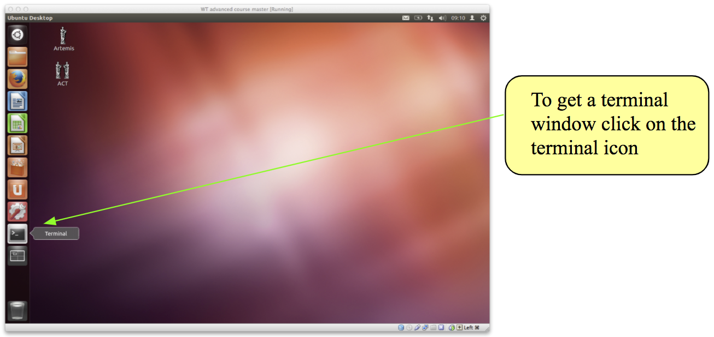
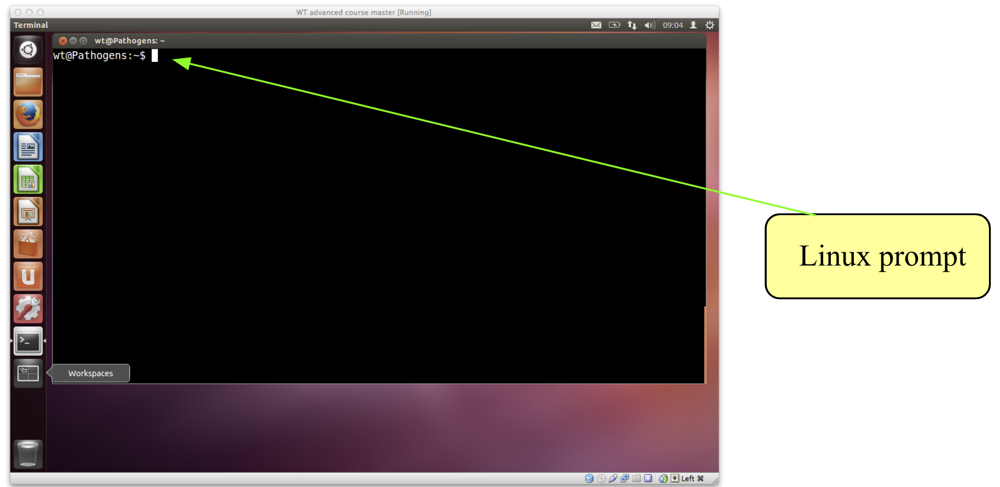
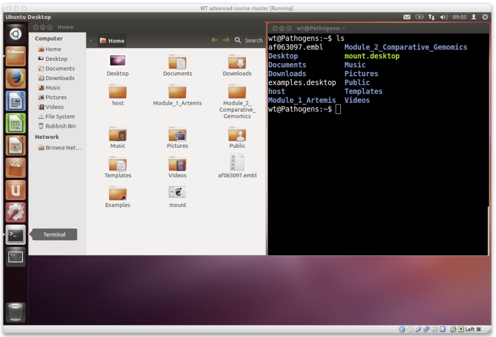
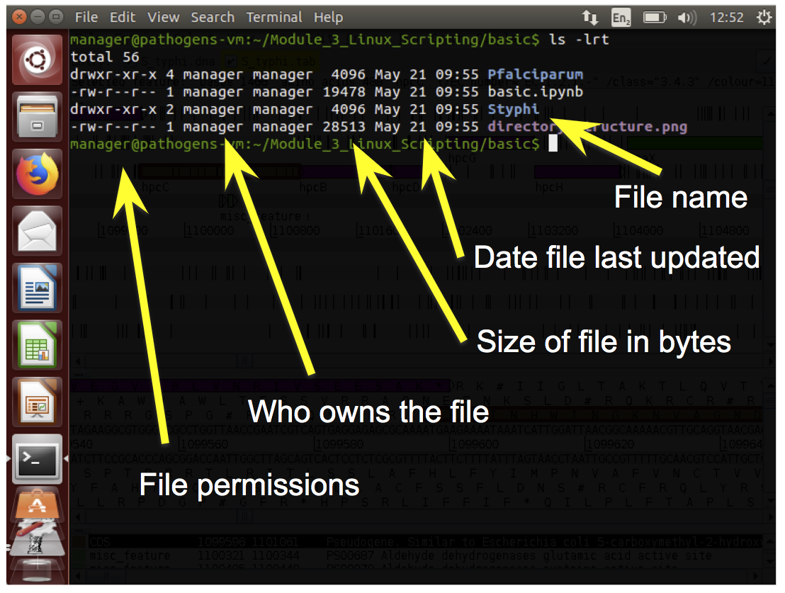
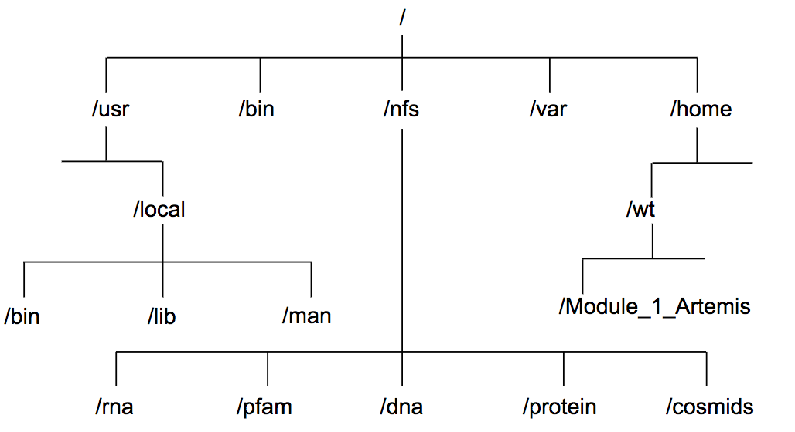

# Module - Linux Scripting

## Overview and Aims

### Introducing Linux
Unix is the standard operating system on most large computer systems in scientific
research, in the same way that Microsoft Windows is the dominant operating system
on desktop PCs.

Unix and MS Windows both perform the important job of managing the computer's
hardware (screen, keyboard, mouse, hard disks, network connections, etc...) on
your behalf. They also provide you with tools to manage your files and to run
application software. They both offer a graphical user interface (desktop). These
desktop interfaces look different between the operating systems, use different
names for things (e.g. directory versus folder) and have different images but
they mostly offer the same functionality.

Unix is a powerful, secure, robust and stable operating system which allows dozens
of people to run programs on the same computer at the same time. This is why it
is the preferred operating system for large-scale scientific computing. It runs
on all kinds of machines, from mobile phones (Android), desktop PCs... to supercomputers.

### Why Linux

Increasingly, the output of biological research exists as in silico data, usually
in the form of large text files. Unix is particularly suitable for working with
such files and has several powerful and flexible commands that can be used to
process and analyse this data. One advantage of learning Unix is that many of the
commands can be combined in an almost unlimited fashion. So if you can learn just
six Unix commands, you will be able to do a lot more than just six things.

Unix contains hundreds of commands, but to conduct your analysis you will probably
only need 10 or so to achieve most of what you want to do. In this course we will
introduce you to some basic Unix commands followed by some more advanced commands
and provide examples of how they can be used in bioinformatics analyses.

### Sections of the Unix course
1. Basic unix
2. Files
3. loops and bash scripts
4. grep
5. awk


### General points to consider
- Linux is pretty straightforward, but there are some general points to remember that will make your life easier:
     - Linux is case sensitive - typing "ls" is not the same as typing "LS".
     - You need to put a space between a command and its argument - for example, "more myfile" will show you the contents of the file called myfile; "moremyfile" will just give you an error!
     - Linux is not psychic! If you misspell the name of a command or the name of a file, it will not understand you.
     - Many of the commands are only a few letters long; this can be confusing until you start to think logically about why those letters were chosen - ls for list, rm for remove and so on.
     - Often when you have problems with Linux, it is due to a spelling mistake, or perhaps you have omitted a space.
- If you want to know more about Linux and its commands there are plenty of resources available that provide a more comprehensive guide, for example:
     - http://Linuxhelp.com
     - https://learn.datacamp.com/

### Following the course in a terminal
- In this course you will use a terminal window to type in your Unix commands.
- This is similar to the "Command Prompt" window on MS Windows systems, which allows the user to type DOS commands to manage files.


### Cheat sheet
- We've also included a cheat sheet. It probably won't make a lot of sense now, but it might be a useful reminder of this module later in the course.

### Some useful Linux commands
| Command   |    What it does   |
| ---  |    ---  |
| ls   | Lists the contents of the current directory  |
| mkdir | Makes a new directory    |
| mv   | moves or renames a file  |
| cp   | copies a file  |
| rm   | removes a file |
| cat | concatenates two or more files |
| less |    displays the contents of a file one page at a time     |
| head | displays the first ten lines of a file |
| tail |    displays the last ten lines of a file   |
| cd | change directory   |
| pwd | print the working directory |
| find | find files matching an expression     |
| grep | search for a pattern within a file    |
| wc | count the lines, words, characters or bytes in a file |
| kill | stop a process |
| jobs | list the processes that are running |

### Tips to get you started
- read the text! They contain lots of hints that should help you to answer some of the questions
- grey boxes contain instructions for running commands
     - lines that start with a hash, ie "#" are a comment line - do not type these out.
     - lines that start with the following symbols should be typed out
          - "$" : this is a shell prompt
          - ">" :  this is a R prompt
               - note that you also see this on the shell prompt if you have not completed a command correctly
          - ">>>" : this is the python prompt


### Lets get started with the command line
- In this workshop, we will be using Ubuntu, a version of Linux which was specially designed for PCs.

- We will use a terminal window to type in our Linux command line.
     - This is similar to the "Command Prompt" window on MS Windows systems, which allows the user to type DOS commands to manage files.



- You should see a window labelled "Terminal" which will be empty except for a ’$' character at the top left.      
     - The '$' character is the Linux prompt, similar to "C:\" in DOS. Note: the prompt will often be different on different Linux computers, for example it may be displayed as a ‘%’ character.

- All Linux programs may be run by typing commands at the Linux prompt $. The command line tells the computer what to do.
     - You can type commands directly into the terminal at the ‘$' prompt.



```bash
# your first command – move to the working directory to get started!

cd /home/manager/Module2_Linux_Scripting
```

- A list of useful commands can be found on a previous page.
     - Many of them are two- or three-letter abbreviations. The earliest Linux systems (circa 1970) only had slow Teletype terminals, so it was faster to type 'rm' to remove a file than 'delete' or 'erase'. This terseness is a feature of Linux which still survives.


### Command line arguements
- You may subtly alter these commands by specifying certain options when typing in the command line.
- Typing any Linux command for example ls, mv or cd at the Linux prompt with the appropriate variables such as files names or directories will result in the tasks being performed on pressing the enter key.
- The ‘command’ is separated from the options and arguments by a space.  
- Additional options and/or arguments can be added to the commands to affect the way the command works.
- Options usually have one dash and a letter (e.g. -h) or two dashes and a word (--help) with no space between the dash and the letter/word.
- Arguments are usually filenames or directories.
- For example, to get a list of files in the terminal you can use the ls command with no other options. This tells the computer you want a list of all the files in the current directory.  The same information is also displayed in the file browser but with nice looking pictures.



- Lets try out some different examples of the "ls" command:
```bash
# List the contents of a directory
$ ls

# List the contents of a directory with extra information about the files
$ ls –l

# List all contents including hidden files & directories
$ ls –al 	

# List the contents of the directory called basic with extra information
$ ls –l basic

# Suggested usage – this will be the most frequent command used as a bioinformatician!
$ ls –ltr

# where:
	–l gives the long format,
	-t sort the output by time,
	–r reverse sorts the output.

# this will therefore provide a detailed list, with the most recent files at the bottom. This is really useful if you have a lot of files in the same directory
```

- By using the –l option we can change the behaviour of the ls command. Instead of printing out a simple list, it will print out additional information about each file. There is a space between the command ls and the –l option. There is no space between the dash and the letter l.



### Permissions
- Every file has permissions which restrict what can be done with a file or directory.  

| Permission   |    What it does   |
| --- | --- |
| Read (r) |	permission to read from a file/directory |
| Write (w) | 	permission to modify a file/directory |
| Execute (x) | 	Tells the operating system that the file contains code for the computer to run, as opposed to a file of text which you open in a text editor. |

- The first set of permissions (characters 2,3,4) refer to what the owner of the file can do,
- the second set of permissions (5,6,7) refers to what members of the Linux group can do
- the third set of permissions (8,9,10) refers to what everyone else can do.


### Files and Directories
- Directories are the Linux equivalent of folders on a PC or Mac.
- They are organised in a hierarchy, so directories can have sub-directories and so on.
- Directories are very useful for organising your work and keeping your account tidy - for example, if you have more than one project, you can organise the files for each project into different directories to keep them separate. You can think of directories as rooms in a house. You can only be in one room (directory) at a time. When you are in a room you can see everything in that room easily. To see things in other rooms, you have to go to the appropriate door and crane your head around. Linux works in a similar manner, moving from directory to directory to access files.
- The location or directory that you are in is referred to as the current working directory.



- Therefore, if there is a file called genome.seq in the dna directory its location or full pathname can be expressed as /nfs/dna/genome.seq.

### pwd - find where you are
- The command pwd stands for print working directory.
- A command (also known as a program) is something which tells the computer to do something. Commands are therefore often the first thing that you type into the terminal (although we'll show you some advanced exceptions to this rule later).
- As described above, directories are arranged in a hierarchical structure. To determine where you are in the hierarchy you can use the pwd command to display the name of the current working directory. The current working directory may be thought of as the directory you are in, i.e. your current position in the file-system tree.

```bash
# To find out where you are, type this into your terminal.
$ pwd

$ cd basic

$ pwd

```
- Remember that Unix is case sensitive, *PWD* is not the same as *pwd*.
- pwd will list each of the folders you would need to navigate through to get from the root of the file system to your current directory.
     - This is sometimes referred to as your 'absolute path' to distinguish that it gives a complete route rather than a 'relative path' which tells you how to get from one folder to another.
     - More on that shortly ...
